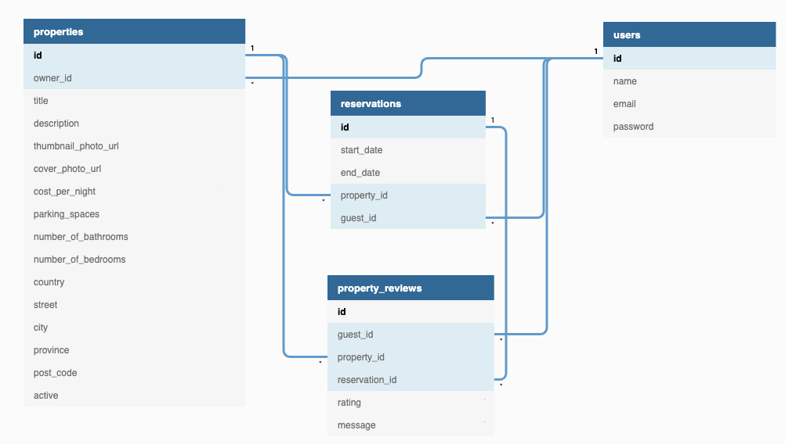

# LightBnB

## Introduction

> This is a project from Lighthouse Labs

We have a new idea for an app that will revolutionize the travel industry. It will allow home owners to rent out their homes to people on vacation, creating an alternative to hotels and bed and breakfasts. We'll be creating the first ever application to do something like this and we will call it **LightBnB**.

We will be starting from scratch here, so everything is going to be built from the ground up.

- We will start by designing the database and creating an ERD for the tables.
- Then we will create the database and the tables using the ERD.
- We will add some fake data to the database to make testing queries easier.
- Then we will start writing queries.
- Finally, we will connect the database to a javascript application so that we can interact with the data from a web page.

### Logging in to DB

We can log in to `psql` normally however we can log in with everything already set up

        psql -h localhost -p 5432 -U user bootcampx

we can reset the password

`psql` then run
```psql
ALTER USER user WITH PASSWORD 'new_password';
```

### ERD

Here is the ERD diagram that LHL is going to make me use from now on




## Project Structure

```tree
├── db
│   ├── database.js
│   └── json
├── erd.png
├── package.json
├── package-lock.json
├── public
│   ├── index.html
│   ├── javascript
│   └── styles
├── README.md
├── routes
│   ├── apiRoutes.js
│   └── userRoutes.js
├── server.js
└── styles
    ├── _forms.scss
    ├── _header.scss
    ├── main.scss
    └── _property-listings.scss
```

* `db` contains all the database interaction code
  * `json` is a directory that contains a bunch of dummy data in `.json files.` 
  * `database.js` is responsible for all queries to the database. It doesn't currently connect to any database, all it does is return data from `.json` files
* `public` contains all of the HTML, CSS, and client side JavaScript
  * `index.html` is the entry point to the application. It's the only html page because this is a single page application
  * `javascript` contains all of the client side javascript files
    * `index.js` starts up the application by rendering the listings
    * `network.js` manages all ajax requests to the server
    * `views_manager.js` manages which components appear on screen
    * `components` contains all of the individual html components. They are all created using jQuery
* `server.js` is the entry point to the application. This connects the routes to the database
* `routes` contains the router files which are responsible for any HTTP requests to `/users/something` or `/api/something`
  * `apiRoutes.js` and `userRoutes.js` are responsible for any HTTP requests to `/users/something` or `/api/something`
* `styles` contains all of the sass files