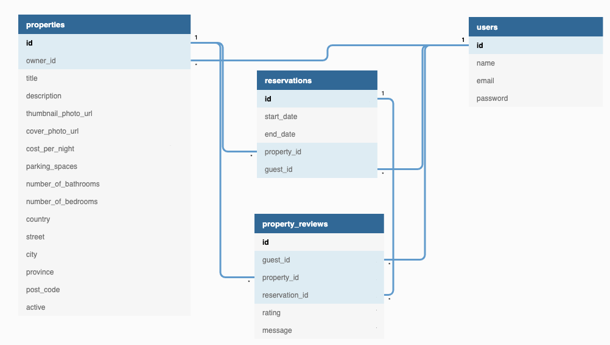

# LightBnB

## Introduction

> This is a project from Lighthouse Labs

We have a new idea for an app that will revolutionize the travel industry. It will allow home owners to rent out their homes to people on vacation, creating an alternative to hotels and bed and breakfasts. We'll be creating the first ever application to do something like this and we will call it **LightBnB**.

We will be starting from scratch here, so everything is going to be built from the ground up.

- We will start by designing the database and creating an ERD for the tables.
- Then we will create the database and the tables using the ERD.
- We will add some fake data to the database to make testing queries easier.
- Then we will start writing queries.
- Finally, we will connect the database to a javascript application so that we can interact with the data from a web page.

### ERD

Here are the specifications for the ERD

- The app will have `users`, `properties`, `reservations`, and `property reviews`

- A user will have a `name`, `email address`,and `password`

- A `property` will have a `title`, `description`, `costpernight`, `parking_spaces`, `numberofbathrooms`, and `numberofbedrooms`

- A `property` will need to have images associated with it, so for now we will store a url for a **small thumbnail photo** and a **large cover photo**

- A `property` will need address data associated with it including `country`, `street`, `city`, `province`, `post_code`

- A `property` can either be `active` or `not active` depending on weather the owner is currently renting it out or not

- A `property` will have an owner which will be one of the registered users

- A `reservation` will have a `start date` and an `end date`

- A `reservation` will be made by a guest, which will be a registered user, and will be associated with a single `property`

- A `property` review will have a `message` and a `rating` from 1 to 5

- A **property review** can be made by a guest and will be associated with a single `reservation`

- A `user` can own many `properties`

- A `property` belongs to one `owner`

- A `user` can make many `reservation`

- A `reservation` belongs to one `guest`

- A `property` can be reviewed by many `guests`


Here is the ERD diagram that LHL is going to make me use from now on




## Project Structure

```
├── public
│   ├── index.html
│   ├── javascript
│   │   ├── components 
│   │   │   ├── header.js
│   │   │   ├── login_form.js
│   │   │   ├── new_property_form.js
│   │   │   ├── property_listing.js
│   │   │   ├── property_listings.js
│   │   │   ├── search_form.js
│   │   │   └── signup_form.js
│   │   ├── index.js
│   │   ├── libraries
│   │   ├── network.js
│   │   └── views_manager.js
│   └── styles
├── sass
└── server
  ├── apiRoutes.js
  ├── database.js
  ├── json
  ├── server.js
  └── userRoutes.js
```

* `public` contains all of the HTML, CSS, and client side JavaScript. 
  * `index.html` is the entry point to the application. It's the only html page because this is a single page application.
  * `javascript` contains all of the client side javascript files.
    * `index.js` starts up the application by rendering the listings.
    * `network.js` manages all ajax requests to the server.
    * `views_manager.js` manages which components appear on screen.
    * `components` contains all of the individual html components. They are all created using jQuery.
* `sass` contains all of the sass files. 
* `server` contains all of the server side and database code.
  * `server.js` is the entry point to the application. This connects the routes to the database.
  * `apiRoutes.js` and `userRoutes.js` are responsible for any HTTP requests to `/users/something` or `/api/something`. 
  * `json` is a directory that contains a bunch of dummy data in `.json` files.
  * `database.js` is responsible for all queries to the database. It doesn't currently connect to any database, all it does is return data from `.json` files.